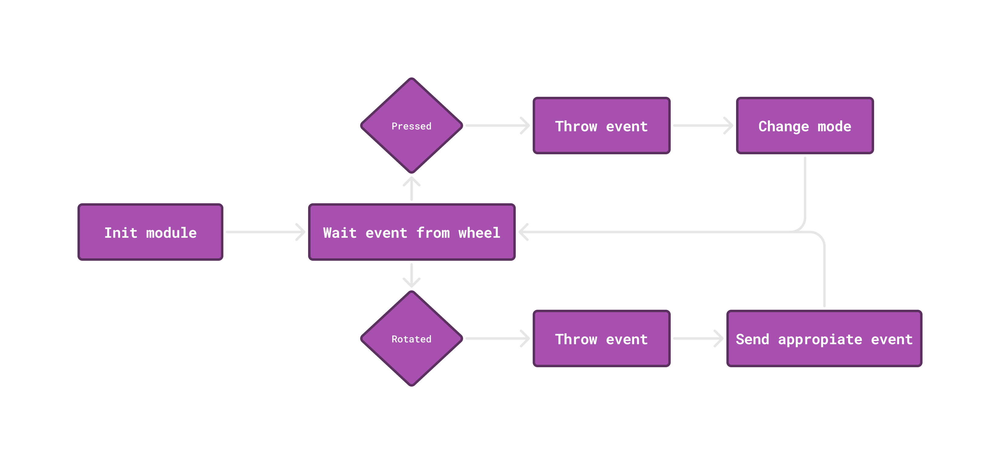

# My enchanted keyboard driver :rainbow: :unicorn: :sparkles:

This is a simple keyboard driver that I wrote for my own keyboard just for fun.
My keyboard is a [Redragon K673 PRO 75%](https://www.redragonzone.com/products/redragon-k673-pro-75-wireless-gasket-rgb-gaming-keyboard?_pos=1&_sid=bf487625c&_ss=r) that presents a wheel on the left side that can be used to control the volume. 

This driver allow to use the wheel to control other things like the brightness of the screen, the volume of the system, or any other thing that you can imagine.

<center>

</center>

## How it works :gear:

The driver is written in C and uses the [Linux Input Subsystem](https://www.kernel.org/doc/html/latest/input/input.html) to read the events of the wheel. 

It a simple kernel module that track the differents modes defined by the user for the different beahviors of the wheel. When the wheel is pressed the current mode is changed and the wheel is used to control the value of the current mode.

It's possible to interact with the driver using the GUI that comes with it. To allow the GUI to interact with the driver, the driver creates a file in `/sys/class/kb-ench/mode` that can be read and written to change the current mode.

<center>

</center>

### Modes

The driver has three modes by default, but it can be extended to have more modes.

 - **Volume mode :speaker:**: is used to control the volume of the system. The wheel is used to increase or decrease the volume.
 - **Brightness mode :sunny:**: is used to control the brightness of the screen. The wheel is used to increase or decrease the brightness.
 - **Scroll mode :computer_mouse:**: is used to scroll the screen. The wheel is used to scroll up or down.

## User interface :art:

The driver comes with a simple GUI that allow to manage the different modes of the wheel. The GUI is written in Rust using the [gtk-rs](https://gtk-rs.org/) library for GTK3. 

The GUI to be useful need to be started using some kind of keybinding or a shortcut. I use the Cinnamon keybinding to start the GUI with the `Ctrl+<push wheel>` shortcut. But I'm sure that you can find a more human way to start it.

> :x:  You can't use the wheel to move through the GUI. You need to use the keyboard to navigate or the mouse.

### Styles

The styles are written in CSS and can be changed to fit the user preferences.
After installation the styles are copied to the `.config/kb-ench/` folder.

## How to use it :computer:

This kernel module is designed for me and I don't know if it will work for you. But if you want to try it, you can follow the next steps:

1. Clone the repository
```bash
git clone https://github.com/CiZ01/kb-enchant.git
```

2. Run the build script
```bash
cd kb-enchant
./build.sh # be sure to have execute permissions
```

3. Install the rest
```bash
./install.sh # will be asked for the root password
```
The install script will load the kernel module and install the GUI to manage the different modes.
It will also create a service that add necessary permissions to the `/sys/class/kb-ench/mode` file and add the module to the `/etc/modules` file for the module to be loaded at boot. After that it copy the GUI config in `.config/kb-ench/`

## Advises are welcome :bulb:

If you have any advise or suggestion to improve the driver or the GUI, please let me know. I'm always open to learn new things and improve my code.


